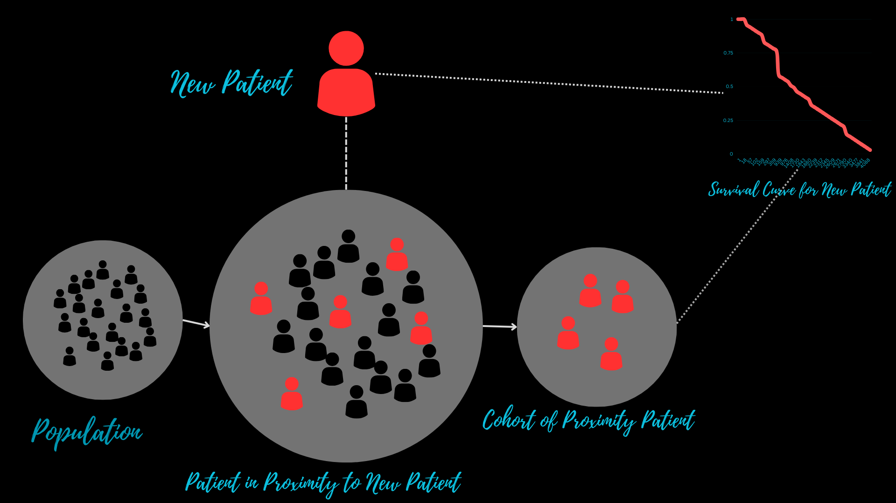

 

# cobsurv : Cobra Ensemble for Conditional Survival

[](https://cobsurv.readthedocs.io/en/latest/?badge=latest)





Cobra Ensemble for Conditional Survival are algorithms, designed for survival prediction
using proximity information. The k-NN survival, Random Survival Forest, Kernel Survival
are some examples of Cobra Ensemble for Conditional Survival. While this package tends 
to provide those algorithms later, currently the package provides the following algorithms:

- COBRA Survival 

For now other algorithms are taken from scikit-survival and np_survival to provide as
a base learner for the ensemble algorithms.

## installation

```
pip install cobsurv
```

The documentation is available at [https://cobsurv.readthedocs.io/en/latest/](https://cobsurv.readthedocs.io/en/latest/)


## Citation
```
@misc{goswami2023areanorm,
      title={Area-norm COBRA on Conditional Survival Prediction}, 
      author={Rahul Goswami and Arabin Kr. Dey},
      year={2023},
      eprint={2309.00417},
      archivePrefix={arXiv},
      primaryClass={cs.LG}
}
```